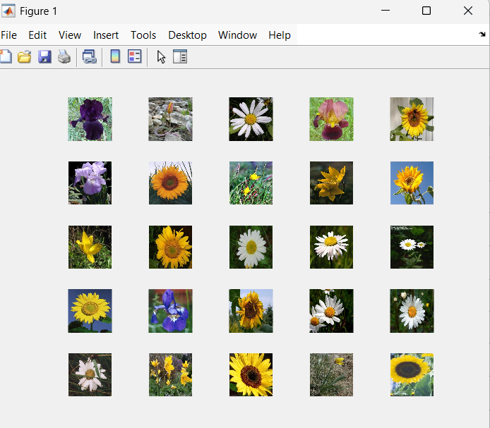

# Project : Flower Classification Using CNN 
This project classifies flowers using a Convolutional Neural Network (CNN) in MATLAB.
## Features:
- Uses deep learning to classify flowers.
- Applies data augmentation techniques.
- Trained with 4 classes of flowers.
## Demo:
#### Input image:

#### Output image:

